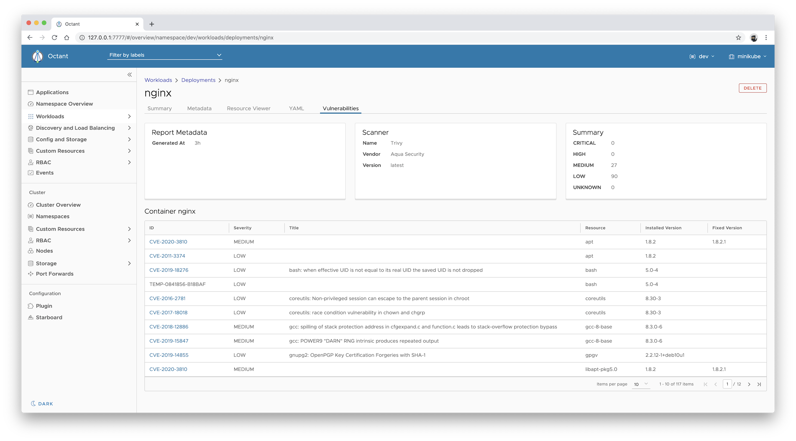
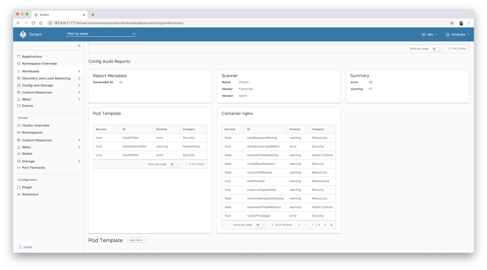
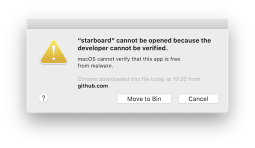
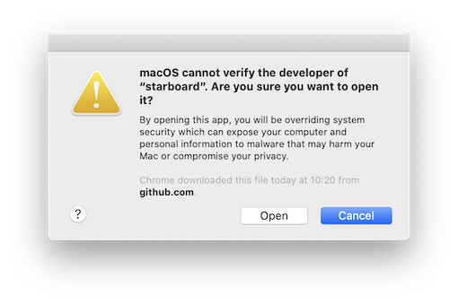
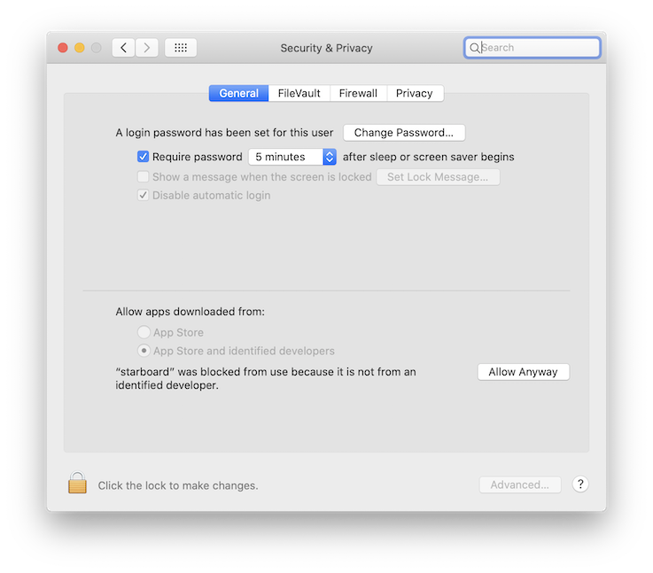

> Kubernetes-native security tool kit.

[![GitHub Release][release-img]][release]
[![GitHub Build Actions][build-action-img]][actions]
[![GitHub Release Action][release-action-img]][actions]
[![Coverage Status][cov-img]][cov]
[![Go Report Card][report-card-img]][report-card]
[![License][license-img]][license]
[![GitHub All Releases][github-all-releases-img]][release]

## Table of Contents

- [Introduction](#introduction)
- [Installation](#installation)
  - [From the Binary Releases](#from-the-binary-releases)
    - [As a kubectl plugin](#kubectl-plugin)
  - [From Source (Linux, macOS)](#from-source-linux-macos)
  - [Docker](#docker)
- [Getting Started](#getting-started)
- [Next Steps](#next-steps)
- [Configuration](#configuration)
- [Custom Security Resources Definitions](#custom-security-resources-definitions)
- [Starboard CLI](#starboard-cli)
- [Troubleshooting](#troubleshooting)
- [Contributing](#contributing)
- [License](#license)

## Introduction

Starboard integrates security tools into the Kubernetes environment, so that users can find and view the risks that
relate to different resources in a Kubernetes-native way. Starboard provides
[custom security resources definitions][starboard-crds] and a [Go module][starboard-go-module] to work with a range
of existing security tools, as well as a `kubectl`-compatible command-line tool and an Octant plug-in that make security
reports available through familiar Kubernetes tools.

You can read more about the motivations and use cases [here][aqua-starboard-blog] and join our discussions [here][discussions]. 


## Installation

This guide shows how to install the [Starboard CLI][starboard-cli] from source,
or from pre-built binary releases.

### From the Binary Releases

Every [release][release] of Starboard provides binary releases for a variety of operating systems. These
binary versions can be manually downloaded and installed.

1. Download your [desired version][release]
2. Unpack it (`tar -zxvf starboard_darwin_x86_64.tar.gz`)
3. Find the `starboard` binary in the unpacked directory, and move it to its desired destination
   (`mv starboard_darwin_x86_64/starboard /usr/local/bin/starboard`)

From there, you should be able to run Starboard CLI commands: `starboard help`

#### kubectl plugin

The Starboard CLI is compatible with [kubectl][kubectl] and is intended as [kubectl plugin][kubectl-plugins],
but it's perfectly fine to run it as a stand-alone executable. If you rename the `starboard` executable to
`kubectl-starboard` and if it's in your path, you can invoke it using `kubectl starboard`.

You can also install Starboard as a kubectl plugin with the [Krew][krew] plugins manager:

```
$ kubectl krew install starboard
$ kubectl starboard help
```

### From Source (Linux, macOS)

Building from source is slightly more work, but is the best way to go if you want to test the latest (pre-release)
version of Starboard.

You must have a working Go environment.

```
$ git clone git@github.com:aquasecurity/starboard.git
$ cd starboard
$ make
```

If required, it will fetch the dependencies and cache them. It will then compile `starboard` and place it in
`bin/starboard`.

### Docker

We also release the Docker image `docker.io/aqusec/starbaord` to run Starboard as a Docker container or to manually
schedule Kubernetes scan Jobs in your cluster.

```
$ docker container run --rm docker.io/aquasec/starboard:0.4.0 version
Starboard Version: {Version:0.4.0 Commit:dd8e49701c1817ea174061c8731fe5bdbfb73d93 Date:2020-09-21T09:36:59Z}
```

## Getting Started

The easiest way to get started with Starboard is to use [Starboard CLI][starboard-cli], which allows scanning Kubernetes
workloads deployed in your cluster.

To begin with, execute the following one-time setup command:

```
$ starboard init
```

The `init` subcommand creates the `starboard` namespace, in which Starboard executes Kubernetes Jobs to perform
scans. It also sends custom security resources definitions to the Kubernetes API:

```
$ kubectl api-resources --api-group aquasecurity.github.io
NAME                   SHORTNAMES    APIGROUP                 NAMESPACED   KIND
ciskubebenchreports    kubebench     aquasecurity.github.io   false        CISKubeBenchReport
configauditreports     configaudit   aquasecurity.github.io   true         ConfigAuditReport
kubehunterreports      kubehunter    aquasecurity.github.io   false        KubeHunterReport
vulnerabilityreports   vulns,vuln    aquasecurity.github.io   true         VulnerabilityReport
```

> There's also a `starboard cleanup` subcommand, which can be used to remove all resources created by Starboard.

As an example let's run an old version of `nginx` that we know has vulnerabilities. Create an `nginx` Deployment in the
`dev` namespace:

```
$ kubectl create deployment nginx --image nginx:1.16 --namespace dev
```

Run the scanner to find the vulnerabilities:

```
$ starboard find vulnerabilities deployment/nginx --namespace dev
```

Behind the scenes, this uses [Trivy][trivy] to identify vulnerabilities in the container images associated with the
specified deployment. Once this has been done, you can retrieve the latest vulnerability reports for this workload:

```
$ starboard get vulnerabilities deployment/nginx \
  --namespace dev \
  --output yaml
```

Starboard relies on labels and label selectors to associate vulnerability reports with the specified Deployment.
For a Deployment with *N* container images Starboard creates *N* instances of `vulnerabilityreports.aquasecurity.github.io`
resources. In addition, each instance has the `starboard.container.name` label to associate it with a particular
container's image. This means that the same data retrieved by the `starboard get vulnerabilities` subcommand can be
fetched with the standard `kubectl get` command:

```
$ kubectl get vulnerabilityreport \
  --selector starboard.resource.kind=Deployment,starboard.resource.name=nginx \
  --namespace dev \
  --output yaml
```

In this example, the `nginx` deployment has a single container called `nginx`, hence only one instance of the
`vulnerabilityreports.aquasecurity.github.io` resource is created with the label `starboard.container.name=nginx`.

To read more about custom resources and label selectors check [Custom Security Resources Specification][starboard-crds-spec].

The [Starboard Octant plugin][starboard-octant-plugin] displays the same vulnerability reports in Octant's UI.

<p align="center">
  
</p>

Check the plugin's repository for installation instructions.

## Next Steps

Let's take the same `nginx` Deployment and audit its Kubernetes configuration. As you remember we've created it with
the `kubectl create deployment` command which applies the default settings to the deployment descriptors. However, we
also know that in Kubernetes the defaults are usually the least secure.

Run the scanner to audit the configuration using [Polaris][polaris]:

```
$ starboard polaris deployment/nginx --namespace dev
```

Retrieve the configuration audit report:

```
$ starboard get configaudit deployment/nginx \
  --namespace dev \
  --output yaml
```

or

```
$ kubectl get configauditreport \
  --selector starboard.resource.kind=Deployment,starboard.resource.name=nginx \
  --namespace dev \
  --output yaml
```

Similar to vulnerabilities the Starboard Octant plugin can visualize config audit reports. What's more important,
Starboard and Octant provide a single pane view with visibility into potentially dangerous and exploitable
vulnerabilities as well as configuration issues that might affect stability, reliability, and scalability of the
`nginx` Deployment.

<p align="center">
  
</p>

To learn more about the available Starboard commands and scanners, such as [kube-bench][aqua-kube-bench] or
[kube-hunter][aqua-kube-hunter], use `starboard help`.

## Configuration

The `starboard init` command creates the `starboard` ConfigMap in the `starboard` namespace, which contains the default
configuration parameters. You can change the default config values with `kubectl patch` or `kubectl edit` commands.

For example, by default Trivy displays vulnerabilities with all severity levels (`UNKNOWN,LOW,MEDIUM,HIGH,CRITICAL`).
However, you can opt in to display only `HIGH` and `CRITICAL` vulnerabilities by patching the `trivy.severity` value
in the `starboard` ConfigMap:

```
$ kubectl patch configmap starboard -n starboard \
  --type merge \
  -p '{"data": {"trivy.severity":"HIGH,CRITICAL"}}'
```

The following table lists available configuration parameters.

| CONFIGMAP KEY         | DEFAULT                                                | DESCRIPTION |
| --------------------- | ------------------------------------------------------ | ----------- |
| `trivy.httpProxy`     | N/A                                                    | The HTTP proxy used by Trivy to download the vulnerabilities database from GitHub |
| `trivy.severity`      | `UNKNOWN,LOW,MEDIUM,HIGH,CRITICAL`                     | A comma separated list of severity levels reported by Trivy |
| `polaris.config.yaml` | [Check the default value here][default-polaris-config] | Polaris configuration file |

> **Note:** You can find it handy to delete a configuration key, which was not created by default by the
> `starboard init` command. For example, the following `kubectl patch` command deletes the `trivy.httpProxy` key:
>
> ```
> $ kubectl patch configmap starboard -n starboard \
>   --type json \
>   -p '[{"op": "remove", "path": "/data/trivy.httpProxy"}]'
> ```

## Custom Security Resources Definitions

This project houses CustomResourceDefinitions (CRDs) related to security and compliance checks along with the code
generated by Kubernetes [code generators][k8s-code-generator] to write such custom resources in a natural way.

| NAME                                             | SHORTNAMES   | APIGROUP               | NAMESPACED |  KIND               |
| ------------------------------------------------ | ------------ | ---------------------- | ---------- | ------------------- |
| [vulnerabilityreports][vulnerabilityreports-crd] | vulns,vuln   | aquasecurity.github.io | true       | VulnerabilityReport |
| [configauditreports][configauditreports-crd]     | configaudit  | aquasecurity.github.io | true       | ConfigAuditReport   |
| [ciskubebenchreports][ciskubebenchreports-crd]   | kubebench    | aquasecurity.github.io | false      | CISKubeBenchReport  |
| [kubehunterreports][kubehunterreports-crd]       | kubehunter   | aquasecurity.github.io | false      | KubeHunterReport    |

See [Custom Security Resources Specification][starboard-crds-spec] for the detailed explanation of custom resources
used by Starboard and their lifecycle.

## Starboard CLI

Starboard CLI is a single executable binary which can be used to find risks, such as vulnerabilities or insecure Pod
specs, in Kubernetes workloads. By default, the risk assessment reports are stored as
[custom security resources][starboard-crds].

To learn more about the available Starboard CLI commands, run `starboard help` or type a command followed by the
`-h` flag:

```
$ starboard kube-hunter -h
```

## Troubleshooting

### "starboard" cannot be opened because the developer cannot be verified. (macOS)

Since Starboard CLI is not registered with Apple by an identified developer, if you try to run it for the first time
you might get a warning dialog. This doesn't mean that something is wrong with the release binary, rather macOS can't
check whether the binary has been modified or broken since it was released.

<p align="center">
  
</p>

To override your security settings and use the Starboard CLI anyway, follow these steps:

1. In the Finder on your Mac, locate the `starboard` binary.
2. Control-click the binary icon, then choose Open from the shortcut menu.
3. Click Open.

   <p align="center">
     
   </p>

   The `starboard` is saved as an exception to your security settings, and you can use it just as you can any registered
   app.

You can also grant an exception for a blocked Starboard release binary by clicking the Allow Anyway button in the
General pane of Security & Privacy preferences. This button is available for about an hour after you try to run the
Starboard CLI command.

To open this pane on your Mac, choose Apple menu > System Preferences, click Security & Privacy, then click General.

<p align="center">
  
</p>

## Contributing

At this early stage we would love your feedback on the overall concept of Starboard. Over time we'd love to see
contributions integrating different security tools so that users can access security information in standard,
Kubernetes-native ways.

See our [hacking](HACKING.md) guide for getting your development environment setup.

See our [roadmap](ROADMAP.md) for tentative features in a 1.0 release.

## License

This repository is available under the [Apache License 2.0][license].

[release-img]: https://img.shields.io/github/release/aquasecurity/starboard.svg?logo=github
[release]: https://github.com/aquasecurity/starboard/releases
[build-action-img]: https://github.com/aquasecurity/starboard/workflows/build/badge.svg
[release-action-img]: https://github.com/aquasecurity/starboard/workflows/release/badge.svg
[actions]: https://github.com/aquasecurity/starboard/actions
[cov-img]: https://codecov.io/github/aquasecurity/starboard/branch/master/graph/badge.svg
[cov]: https://codecov.io/github/aquasecurity/starboard
[report-card-img]: https://goreportcard.com/badge/github.com/aquasecurity/starboard
[report-card]: https://goreportcard.com/report/github.com/aquasecurity/starboard
[license-img]: https://img.shields.io/github/license/aquasecurity/starboard.svg
[license]: https://github.com/aquasecurity/starboard/blob/master/LICENSE
[github-all-releases-img]: https://img.shields.io/github/downloads/aquasecurity/starboard/total?logo=github

[aqua-starboard-blog]: https://blog.aquasec.com/starboard-kubernetes-tools
[discussions]: https://github.com/aquasecurity/starboard/discussions
[starboard-crds]: #custom-security-resources-definitions
[starboard-crds-spec]: ./SECURITY_CRDS_SPEC.md
[vulnerabilityreports-crd]: ./kube/crd/vulnerabilityreports-crd.yaml
[ciskubebenchreports-crd]: ./kube/crd/ciskubebenchreports-crd.yaml
[kubehunterreports-crd]: ./kube/crd/kubehunterreports-crd.yaml
[configauditreports-crd]: ./kube/crd/configauditreports-crd.yaml
[starboard-go-module]: ./pkg
[starboard-cli]: #starboard-cli
[starboard-octant-plugin]: https://github.com/aquasecurity/octant-starboard-plugin
[starboard-security-operator]: https://github.com/aquasecurity/starboard-security-operator
[starboard-harbor-webhook]: https://github.com/aquasecurity/starboard-harbor-webhook
[aqua-kube-bench]: https://github.com/aquasecurity/kube-bench
[aqua-kube-hunter]: https://github.com/aquasecurity/kube-hunter
[octant]: https://github.com/vmware-tanzu/octant
[polaris]: https://github.com/FairwindsOps/polaris
[trivy]: https://github.com/aquasecurity/trivy

[k8s-code-generator]: https://github.com/kubernetes/code-generator
[kubectl]: https://kubernetes.io/docs/reference/kubectl
[kubectl-plugins]: https://kubernetes.io/docs/tasks/extend-kubectl/kubectl-plugins

[krew]: https://github.com/kubernetes-sigs/krew

[default-polaris-config]: ./kube/init/starboard-cm.yaml
