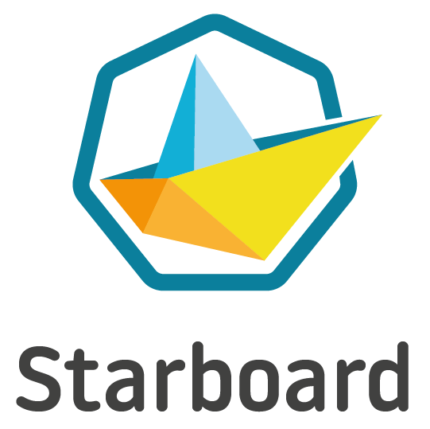

# Starboard is joining Trivy.

We've announced our plans to discontinue Starboard and merge it into [Trivy](https://github.com/aquasecurity/trivy).

Starboard CLI has been reintroduced as [trivy kubernetes](https://aquasecurity.github.io/trivy/latest/docs/target/kubernetes/) command and starboard-operator with a focus on trivy capabilities is available as [Trivy-Operator](https://github.com/aquasecurity/trivy-operator).

We will not be accepting new features/pull requests/issues.
we encourage you to contribute to [Trivy-Operator](https://github.com/aquasecurity/trivy-operator) and [Trivy CLI](https://github.com/aquasecurity/trivy) and influence the future of Trivy Kubernetes.

for more info and [discussions](https://github.com/aquasecurity/starboard/discussions/1173)

Checkout the latest : [What's next for Trivy Q&A](https://www.youtube.com/watch?v=u3cixRRJyYg)

> Kubernetes-native security toolkit.

[![GitHub Release][release-img]][release]
[![Build Action][action-build-img]][action-build]
[![Release snapshot Action][action-release-snapshot-img]][action-release-snapshot]
[![Coverage Status][cov-img]][cov]
[![Go Report Card][report-card-img]][report-card]
[![License][license-img]][license]
[![GitHub All Releases][github-all-releases-img]][release]
![Docker Pulls Starboard][docker-pulls-starboard]
![Docker Pulls Starboard Operator][docker-pulls-starboard-operator]

# Introduction

There are lots of security tools in the cloud native world, created by Aqua and by others, for identifying and informing
users about security issues in Kubernetes workloads and infrastructure components. However powerful and useful they
might be, they tend to sit alongside Kubernetes, with each new product requiring users to learn a separate set of
commands and installation steps in order to operate them and find critical security information.

Starboard attempts to integrate heterogeneous security tools by incorporating their outputs into Kubernetes CRDs
(Custom Resource Definitions) and from there, making security reports accessible through the Kubernetes API. This way
users can find and view the risks that relate to different resources in what we call a Kubernetes-native way.

Starboard provides:

- Automated vulnerability scanning for Kubernetes workloads.
- Automated configuration audits for Kubernetes resources with predefined rules or custom Open Policy Agent (OPA) policies.
- Automated infrastructures scanning and compliance checks with CIS Benchmarks published by the Center for Internet Security (CIS).
- Automated compliance report - NSA, CISA Kubernetes Hardening Kubernetes Guidance v1.0 
- Penetration test results for a Kubernetes cluster.
- [Custom Resource Definitions] and a [Go module] to work with and integrate a range of security scanners.
- The [Octant Plugin] and the [Lens Extension] that make security reports available through familiar Kubernetes interfaces.

Starboard can be used:

- As a [Kubernetes operator] to automatically update security reports in response to workload and other changes on a
  Kubernetes cluster - for example, initiating a vulnerability scan when a new Pod is started or running CIS Benchmarks
  when a new Node is added.
- As a [command][cli], so you can trigger scans and view the risks in a kubectl-compatible way or as part of your CI/CD
  pipeline.

  

# Status

Although we are trying to keep new releases backward compatible with previous versions, this project is still incubating,
and some APIs and [Custom Resource Definitions] may change.

# Documentation

The official [Documentation] provides detailed installation, configuration, troubleshooting, and quick start guides.

Learn how to install the Starboard command [From the Binary Releases] and follow the [Getting Started][getting-started-cli]
guide to generate your first vulnerability and configuration audit reports.

You can install the Starboard Operator with [Static YAML Manifests] and follow the [Getting Started][getting-started-operator]
guide to see how vulnerability and configuration audit reports are generated automatically.

Read more about the motivations for the project in the [Starboard: The Kubernetes-Native Toolkit for Unifying Security]
blog.

# Contributing

At this early stage we would love your feedback on the overall concept of Starboard. Over time, we'd love to see
contributions integrating different security tools so that users can access security information in standard,
Kubernetes-native ways.

* See [Contributing] for information about setting up your development environment, and the contribution workflow that
  we expect.
* See [Roadmap] for tentative features in a 1.0.0 release.

---
Starboard is an [Aqua Security](https://aquasec.com) open source project.  
Learn about our [Open Source Work and Portfolio].  
Join the community, and talk to us about any matter in [GitHub Discussions] or [Slack].

[release-img]: https://img.shields.io/github/release/aquasecurity/starboard.svg?logo=github
[release]: https://github.com/aquasecurity/starboard/releases
[action-build-img]: https://github.com/aquasecurity/starboard/actions/workflows/build.yaml/badge.svg
[action-build]: https://github.com/aquasecurity/starboard/actions/workflows/build.yaml
[action-release-snapshot-img]: https://github.com/aquasecurity/starboard/actions/workflows/release-snapshot.yaml/badge.svg
[action-release-snapshot]: https://github.com/aquasecurity/starboard/actions/workflows/release-snapshot.yaml
[cov-img]: https://codecov.io/github/aquasecurity/starboard/branch/main/graph/badge.svg
[cov]: https://codecov.io/github/aquasecurity/starboard
[report-card-img]: https://goreportcard.com/badge/github.com/aquasecurity/starboard
[report-card]: https://goreportcard.com/report/github.com/aquasecurity/starboard
[license-img]: https://img.shields.io/github/license/aquasecurity/starboard.svg
[license]: https://github.com/aquasecurity/starboard/blob/main/LICENSE
[github-all-releases-img]: https://img.shields.io/github/downloads/aquasecurity/starboard/total?logo=github
[docker-pulls-starboard]: https://img.shields.io/docker/pulls/aquasec/starboard?logo=docker&label=docker%20pulls%20%2F%20starboard
[docker-pulls-starboard-operator]: https://img.shields.io/docker/pulls/aquasec/starboard-operator?logo=docker&label=docker%20pulls%20%2F%20starboard%20operator
[Starboard: The Kubernetes-Native Toolkit for Unifying Security]: https://blog.aquasec.com/starboard-kubernetes-tools
[Contributing]: CONTRIBUTING.md
[Roadmap]: ROADMAP.md
[GitHub Discussions]: https://github.com/aquasecurity/starboard/discussions
[Slack]: https://slack.aquasec.com/
[Open Source Work and Portfolio]: https://www.aquasec.com/products/open-source-projects/

[Custom Resource Definitions]: https://aquasecurity.github.io/starboard/latest/crds/
[Go module]: https://pkg.go.dev/github.com/aquasecurity/starboard/pkg
[cli]: https://aquasecurity.github.io/starboard/latest/cli
[Documentation]: https://aquasecurity.github.io/starboard/
[From the Binary Releases]: https://aquasecurity.github.io/starboard/latest/cli/installation/binary-releases/
[Static YAML Manifests]: https://aquasecurity.github.io/starboard/latest/operator/installation/kubectl/
[getting-started-cli]: https://aquasecurity.github.io/starboard/latest/cli/getting-started/
[getting-started-operator]: https://aquasecurity.github.io/starboard/latest/operator/getting-started/
[Kubernetes operator]: https://aquasecurity.github.io/starboard/latest/operator

[Octant Plugin]: https://aquasecurity.github.io/starboard/latest/integrations/octant
[Lens Extension]: https://aquasecurity.github.io/starboard/latest/integrations/lens
[kubectl]: https://kubernetes.io/docs/reference/kubectl
