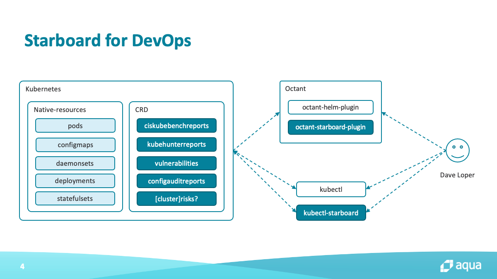

> Kubernetes-native security tool kit.

[![GitHub Release][release-img]][release]
[![Build Actions][build-action-img]][build-action]
[![License][license-img]][license]

## Table of Contents

- [Abstract](#abstract)
- [Rationale](#rationale)
- [Use Cases](#use-cases)
  - [Starboard for DevOps](#starboard-for-devops)
  - [Starboard for Enterprises](#starboard-for-enterprises)
  - [Starboard for Security Vendors](#starboard-for-security-vendors)
- [Installing](#installing)
  - [From the Binary Releases](#from-the-binary-releases)
  - [From Krew](#from-krew)
  - [From Source (Linux, macOS)](#from-source-linux-macos)
- [Getting Started](#getting-started)
- [Next Steps](#next-steps)
- [Custom Security Resources Definitions](#custom-security-resources-definitions)
- [Starboard CLI](#starboard-cli)
- [Troubleshooting](#troubleshooting)
- [Contributing](#contributing)
- [License](#license)

## Abstract

Starboard is a Kubernetes-native security tool kit for finding risks in your Kubernetes workloads and environments.
It provides [custom security resources definitions][starboard-crds] and the [Go module][starboard-go-module] to work
alongside a range of existing security tools, allowing for use cases such as these:

- Develop Kubernetes-native security applications such as:
  - admission webhook servers (like [Anchore Image Validator][anchore-image-validator]
    and [Starboard Admission Webhook][starboard-admission-webhook])
  - container security operators (like [Container Security Operator][container-security-operator]
    and [Starboard Security Operator][starboard-security-operator])
  - vulnerability adapters and exporters (like [KubeTrivyExporter][kube-trivy-exporter])
  - Kubernetes audit tools (like [kubeaudit][kubeaudit] and [Polaris][polaris])
  - Kubernetes resources sanitizers and linters (like [Popeye][popeye])
  - [kubectl plugins][kubectl-plugins] to scan workloads early on in the development stage
    (like [kubectl starboard][kubectl-starboard] plugin)
  - webhook servers for integrating with enterprise cloud native artifacts registries
    (like [Starboard Harbor Webhook][starboard-harbor-webhook])
  - webhook servers for integrating with commercial cloud native security platforms
    (like [Starboard Aqua CSP Webhook][starboard-aqua-csp-webhook])
- Extend existing Kubernetes dashboards, such as [Octant][octant] or [OpenShift Console][openshift-console], with
  vulnerability assessment reports
- Implement scoring, health check, and metrics systems for the whole Kubernetes cluster or a single namespace,
  aggregating results from different tools to simplify overall security assessments
- Implement custom security dashboards from scratch

## Rationale

By looking at existing Kubernetes security tools you can quickly realize two things. On one hand they differ in many
ways, i.e. have different capabilities, data models, output sinks, license, maturity level and credibility.
On the other hand, they usually have the same or very similar modus operandi, i.e.:

1. Discover Kubernetes workloads via Kubernetes API or by parsing descriptor YAML files
2. Invoke some type of scanner which finds risks, e.g. execute a [Trivy][trivy] binary executable to find container
   image vulnerabilities, invoke a Go function to check SecurityContext of a given Pod, or evaluate a Pod spec against
   some [Rego][opa-rego] rules.
3. Save risk assessment report somewhere, typically to the standard output or a file. JSON/YAML with a free-style schema
   seems to be an "industry" standard.

It's not easy to deal with the results from these different, standalone Kubernetes security tools. 
With all these heterogeneous data models it's very hard to take advantage of all the features provided by a given tool.
Especially when you want to use a few or all of them.

What if all the Kubernetes security tools spoke the same language that everyone knows and understands?
Similarly to the standardized and well known Pod spec, we could come up with the schema for a *vulnerability*,
a *risk assessment check*, a *black-* or *white-listed vulnerability*, or maybe even a *scanner config*. What if you
could combine the results from different tools to give an easy-to-understand overview of current security status? 
This would allow security vendors to focus on what they do best, whereas others could consume the data in the
homogeneous format.

Project Starboard illustrates how the outputs from different security tools can be stored and combined using native
Kubernetes approaches:

* Storing results in Kubernetes CRDs that can be queried using the Kubernetes API
* Using Kubernetes Operators to efficiently manage security assessments of different resources within the cluster
* Using Kubernetes Operators to aggregate results, using flexible policies, into Kubernetes-native CRDs 

## Use Cases

### Starboard for DevOps


One idea behind Starboard is to help development and DevOps teams deliver secure and compliant applications from the
get-go. As shown in the figure below, Dave Loper is using [`kubectl`][kubectl] to deploy and test his applications.
Without learning the whole new tool, he can now use a familiar [`kubectl starboard`][kubectl-starboard] plugin interface
to scan container images, which comprise his applications, for potentially dangerous and exploitable vulnerabilities. He
can also look for configuration issues that might affect stability, reliability, and scalability of his deployment. This
makes Dave Loper a new security guard of his organization. What's more, by doing that his organization effectively
implemented the shift left security principle in SDLC.

Sometimes, to better understand the complexity of his applications, Dave is using [Octant][octant], a Kubernetes
introspective and object management platform. With [Starboard Octant plugin][starboard-octant-plugin] we extended the
Octant's capabilities to present vulnerability and configuration audits in user-friendly manner.



### Starboard for Enterprises

Manual scanning through the [`kubectl starboard`][kubectl-starboard] plugin is useful, but it has its limitations: it
doesn't scale well with a huge number of Kubernetes workloads and / or multi-tenant clusters as is the case for
enterprises.

In such cases a more suitable option is to deploy the [Starboard Security Operator][starboard-security-operator], which
constantly monitors Kubernetes-native resources, such as Deployments, and runs appropriate scanners against the
underlying deployment descriptors. The scan reports can be saved as custom resources in the same instance of
[etcd][etcd] used by the Kubernetes cluster running the workloads, or an etcd instance external to the cluster.

Because they are accessible over the Kubernetes API, the vulnerability reports or any other security audits can be used
to build or integrate with dashboards tailored for SRE and Security teams.

The same data can be used by the [Starboard Admission Webhook][starboard-admission-webhook] to accept or reject new
deployments based on security policies put in place, e.g. number of critical vulnerabilities found in a container
image.

Another interesting scenario would be to take advantage of [Starboard Harbor Webhook][starboard-harbor-webhook] or
[Starboard Aqua CSP Webhook][starboard-aqua-csp-webhook] components to import existing vulnerability reports generated
by Harbor or Aqua CSP respectively via Webhook integrations.


### Starboard for Security Vendors

Starboard provides a framework for security tool developers and vendors, making it easy to integrate their tooling into
Kubernetes in a way that's familiar for users. As a tool developer you can re-use one of the existing CR definitions,
or create a new one. The Starboard code generator saves time and effort on creating the tools to integrate with
Kubernetes tooling, for example creating webhooks and plugins for Starboard.

## Installing

This guide shows how to install the [Starboard CLI][starboard-cli]. Starboard CLI can be installed either from source,
or from pre-built binary releases.

### From the Binary Releases

Every [release][release] of Starboard provides binary releases for a variety of operating systems. These
binary versions can be manually downloaded and installed.

1. Download your [desired version][release]
2. Unpack it (`tar -zxvf starboard_darwin_x86_64.tar.gz`)
3. Find the `starboard` binary in the unpacked directory, and move it to its desired destination
   (`mv starboard_darwin_x86_64/starboard /usr/local/bin/starboard`)

From there, you should be able to run Starboard CLI commands: `starboard help`

### From Krew

The Starboard CLI is compatible with [kubectl][kubectl] and is intended as [kubectl plugin][kubectl-plugins],
but it's perfectly fine to run it as a stand-alone executable. If you rename the `starboard` executable to
`kubectl-starboard` and if it's in your path, you can invoke it using `kubectl starboard`.

Once we resolve [#8][issue-8] our intention is to submit Starboard to [krew-index][krew-index] so that if accepted,
you'll be able to install starboard with [Krew][krew] plugins manager:

```
$ kubectl krew install starboard
$ kubectl starboard help
```

### From Source (Linux, macOS)

Building from source is slightly more work, but is the best way to go if you want to test the latest (pre-release)
version of Starboard.

You must have a working Go environment.

```
$ git clone git@github.com:aquasecurity/starboard.git
$ cd starboard
$ make
```

If required, it will fetch the dependencies and cache them. It will then compile `starboard` and place it in
`bin/starboard`.

## Getting Started

The easiest way to get started with Starboard is to use [Starboard CLI][starboard-cli], which allows scanning Kubernetes
workloads deployed in your cluster.

To begin with, execute the following one-time setup command:

```
$ starboard init
```

The `init` subcommand creates the `starboard` namespace, in which Starboard executes Kubernetes Jobs to perform
scans. It also sends custom security resources definitions to the Kubernetes API:

```
$ kubectl api-resources --api-group aquasecurity.github.io
NAME                              SHORTNAMES   APIGROUP                       NAMESPACED   KIND
ciskubebenchreports               kubebench    aquasecurity.github.io         false        CISKubeBenchReport
configauditreports                configaudit  aquasecurity.github.io         true         ConfigAuditReport
kubehunterreports                 kubehunter   aquasecurity.github.io         false        KubeHunterReport
vulnerabilities                   vulns,vuln   aquasecurity.github.io         true         Vulnerability
```

> There's the `starboard cleanup` subcommand, which can be used to remove all resources created by Starboard.

As an example let's run an old version of `nginx` that we know has vulnerabilities. Create an `nginx` Deployment in the
`dev` namespace:

```
$ kubectl create deployment nginx --image nginx:1.16 --namespace dev
```

Run the scanner to find the vulnerabilities:

```
$ starboard find vulnerabilities deployment/nginx --namespace dev
```

Finally, retrieve the latest vulnerability reports:

```
$ starboard get vulnerabilities deployment/nginx \
  --namespace dev \
  --output yaml
```

Starboard relies on labels and label selectors to associate vulnerability reports with the specified Deployment.
For a Deployment with *N* containers Starboard creates *N* instances of `vulnerabilities.aquasecurity.github.io`
resources. In addition, each instance has the `starboard.container.name` label to associate it with a particular
container's image. This means that the same data retrieved by the `starboard get vulnerabilities` subcommand can be
fetched with the standard `kubectl get` command:

```
$ kubectl get vulnerabilities \
  --selector starboard.resource.kind=Deployment,starboard.resource.name=nginx \
  --namespace dev \
  --output yaml
```

In this example, the `nginx` deployment has a single container called `nginx`, hence only one instance of the
`vulnerabilities.aquasecurity.github.io` resource is created with the label `starboard.container.name=nginx`.

To read more about custom resources and label selectors check [Custom Security Resources Specification][starboard-crds-spec].

For those for whom the CLI interface is not enough, we've implemented the
[Starboard Octant plugin][starboard-octant-plugin] to display the same vulnerability reports in the Octant's interface.

<p align="center">
  
</p>

Check the plugin's repository for the installation instructions.

## Next Steps

Let's take the same `nginx` Deployment and audit its Kubernetes configuration. As you remember we've created it with
the `kubectl create deployment` command which applies the default settings to the deployment descriptors. However, we
also know that in Kubernetes the defaults are usually the least secure.

Run the scanner to audit the configuration:

```
$ starboard polaris
```

> Note that currently the `polaris` subcommand scans workloads in all namespaces. However, once we resolve
> [issue #29][issue-29] it will be possible to scan just a single deployment with
> `starboard polaris deployment/nginx --namespace dev`.

Retrieve the configuration audit report:

```
$ starboard get configaudit deployment/nginx \
  --namespace dev \
  --output yaml
```

or

```
$ kubectl get configaudit \
  --selector starboard.resource.kind=Deployment,starboard.resource.name=nginx \
  --namespace dev \
  --output yaml
```

Similar to vulnerabilities the Starboard Octant plugin can visualize config audit reports. What's more important,
Starboard and Octant provide a single pane view with visibility into potentially dangerous and exploitable
vulnerabilities as well as configuration issues that might affect stability, reliability, and scalability of the
`nginx` Deployment.

<p align="center">
  
</p>

To learn more about the available Starboard commands and scanners, such as [kube-bench][aqua-kube-bench] or
[kube-hunter][aqua-kube-hunter], use `starboard help`.

## Custom Security Resources Definitions

This project houses CustomResourceDefinitions (CRDs) related to security and compliance checks along with the code
generated by Kubernetes [code generators][k8s-code-generator] to write such custom resources in a natural way.

| NAME                                           | SHORTNAMES   | APIGROUP               | NAMESPACED |  KIND              |
| ---------------------------------------------- | ------------ | ---------------------- | ---------- | ------------------ |
| [vulnerabilities][vulnerabilities-crd]         | vulns,vuln   | aquasecurity.github.io | true       | Vulnerability      |
| [ciskubebenchreports][ciskubebenchreports-crd] | kubebench    | aquasecurity.github.io | false      | CISKubeBenchReport |
| [kubehunterreports][kubehunterreports-crd]     | kubehunter   | aquasecurity.github.io | false      | KubeHunterReport   |
| [configauditreports][configauditreports-crd]   | configaudit  | aquasecurity.github.io | true       | ConfigAuditReport  |

See [Custom Security Resources Specification][starboard-crds-spec] for the detailed explanation of custom resources
used by Starboard and their lifecycle.

## Starboard CLI

Starbord CLI is a single executable binary which can be used to find risks, such as vulnerabilities or insecure Pod
specs, in Kubernetes workloads. By default, the risk assessment reports are stored as
[custom security resources][starboard-crds].

To learn more about the available Starboard CLI commands, run `starboard help` or type a command followed by the
`-h` flag:

```
$ starboard kube-hunter -h
```

## Troubleshooting

### "starboard" cannot be opened because the developer cannot be verified. (macOS)

Since Starboard CLI is not registered with Apple by an identified developer, if you try to run it for the first time
you might get a warning dialog. This doesn't mean that something is wrong with the release binary, rather macOS can't
check whether the binary has been modified or broken since it was released.

<p align="center">
  
</p>

To override your security settings and use the Starboard CLI anyway, follow these steps:

1. In the Finder on your Mac, locate the `starboard` binary.
2. Control-click the binary icon, then choose Open from the shortcut menu.
3. Click Open.

   <p align="center">
     
   </p>

   The `starboard` is saved as an exception to your security settings, and you can use it just as you can any registered
   app.

You can also grant an exception for a blocked Starboard release binary by clicking the Allow Anyway button in the
General pane of Security & Privacy preferences. This button is available for about an hour after you try to run the
Starboard CLI command.

To open this pane on your Mac, choose Apple menu > System Preferences, click Security & Privacy, then click General.

<p align="center">
  
</p>

## Contributing

At this early stage we would love your feedback on the overall concept of Starboard. Over time we'd love to see
contributions integrating different security tools so that users can access security information in standard,
Kubernetes-native ways.

See our [hacking](HACKING.md) guide for getting your development environment setup.

See our [roadmap](ROADMAP.md) for tentative features in a 1.0 release.

## License

This repository is available under the [Apache License 2.0][license].

[release-img]: https://img.shields.io/github/release/aquasecurity/starboard.svg
[release]: https://github.com/aquasecurity/starboard/releases
[build-action-img]: https://github.com/aquasecurity/starboard/workflows/build/badge.svg
[build-action]: https://github.com/aquasecurity/starboard/actions
[license-img]: https://img.shields.io/github/license/aquasecurity/starboard.svg
[license]: https://github.com/aquasecurity/starboard/blob/master/LICENSE

[starboard-crds]: #custom-security-resources-definitions
[starboard-crds-spec]: ./SECURITY_CRDS_SPEC.md
[vulnerabilities-crd]: ./kube/crd/vulnerabilities-crd.yaml
[ciskubebenchreports-crd]: ./kube/crd/ciskubebenchreports-crd.yaml
[kubehunterreports-crd]: ./kube/crd/kubehunterreports-crd.yaml
[configauditreports-crd]: ./kube/crd/configauditreports-crd.yaml
[starboard-go-module]: ./pkg
[starboard-cli]: #starboard-cli
[kubectl-starboard]: #from-krew
[starboard-octant-plugin]: https://github.com/aquasecurity/octant-starboard-plugin
[starboard-security-operator]: https://github.com/aquasecurity/starboard-security-operator
[starboard-admission-webhook]: https://github.com/aquasecurity/starboard-admission-webhook
[starboard-aqua-csp-webhook]: https://github.com/aquasecurity/starboard-aqua-csp-webhook
[starboard-harbor-webhook]: https://github.com/aquasecurity/starboard-harbor-webhook
[aqua-kube-bench]: https://github.com/aquasecurity/kube-bench
[aqua-kube-hunter]: https://github.com/aquasecurity/kube-hunter

[k8s-code-generator]: https://github.com/kubernetes/code-generator

[kubectl]: https://kubernetes.io/docs/reference/kubectl
[kubectl-plugins]: https://kubernetes.io/docs/tasks/extend-kubectl/kubectl-plugins

[octant]: https://github.com/vmware-tanzu/octant
[anchore-image-validator]: https://github.com/banzaicloud/anchore-image-validator
[kube-trivy-exporter]: https://github.com/kaidotdev/kube-trivy-exporter
[container-security-operator]: https://github.com/quay/container-security-operator
[kubeaudit]: https://github.com/Shopify/kubeaudit
[openshift-console]: https://github.com/openshift/console
[popeye]: https://github.com/derailed/popeye
[polaris]: https://github.com/FairwindsOps/polaris
[etcd]: https://etcd.io
[trivy]: https://github.com/aquasecurity/trivy
[opa-rego]: https://www.openpolicyagent.org/docs/latest/policy-language/
[krew]: https://github.com/kubernetes-sigs/krew
[krew-index]: https://github.com/kubernetes-sigs/krew-index

[issue-8]: https://github.com/aquasecurity/starboard/issues/8
[issue-29]: https://github.com/aquasecurity/starboard/issues/29
