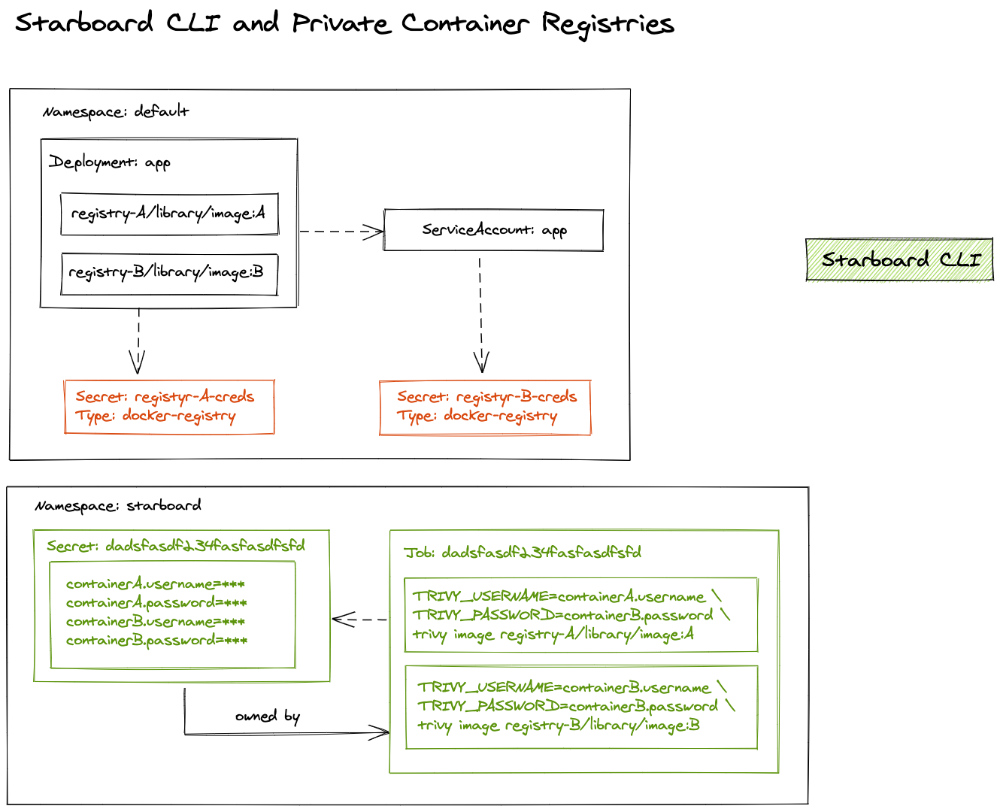

# NOTES

## Starboard CLI and Private Registry Credentials

- Find references to image pull secrets (direct and service account)
- Create a temporary secret with basic credentials for each container of the scanned workload
- Create a scan job that references the temporary secret. The secret has the ownerReference property set to point to the job.
- Watch the job for the completion status
- Delete the job. The secret will be deleted by the Kubernetes garbage collector
