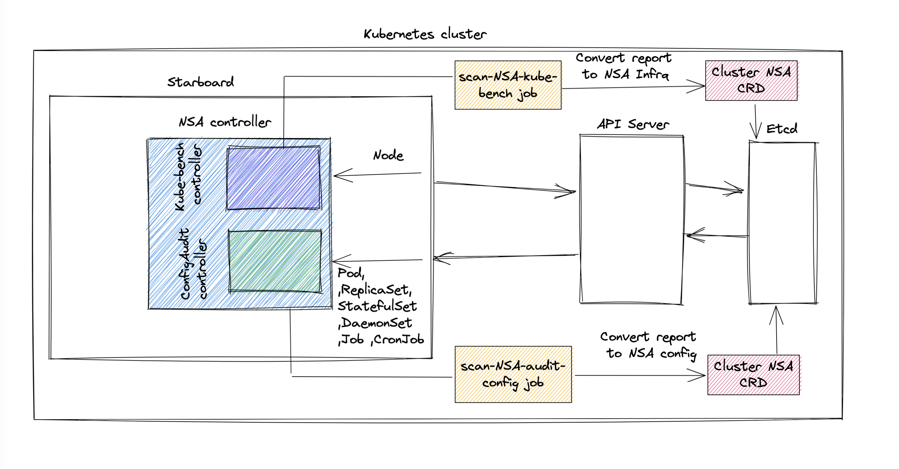

# Support National Security Agency - Kubernetes Hardening Guidance

## Overview

It is required to extend starboard security tools capabilities by supporting the NSA - Kubernetes Hardening Guidance

1. A new NSA plugin will be added to starboard 
2. This new plugin will track different Resource Kinds as describe below: [NSA Tool Analysis](#nsa-tool-analysis) 
    and will trigger the relevant tool (conftest and kube-bench) based on the relevant kind 
3. A CRD will be introduced to represent the NSA checks report


<br><br>

## Solution

### TL;DR;

Add a new starboard plugin to support the NSA specification checks to enhance our Kubernetes Hardening capabilities.
The plugin will use the following tools to scan different kind of resources. 

1. conftest (later to be replaced by trivy-iac) will be triggered to scan all k8s config associated checks
2. kube-bench will be triggered to scan all k8s infra associated checks

### Deep Dive
The below  [NSA Tool Analysis](#nsa-tool-analysis) provides us with the separation of tool to be triggered based on resource kind for the NSA specification.
As seen with the analysis below, in order to make the NSA specification completed, checks need to be used and added to the relevant tools.

Code Changes:
- conftest - the following rego check need to be added to appshield :
  - new
    - `allowedHostPaths` for Limits containers to specific paths of the host file system.
    - `Protecting Pod service account tokens` Controls whether container applications can run with root privileges
    - `ube-systm or kube-public` Domain should should not be used by users (need to confirm it can be done)
    - `policies that select Pods using podSelector and/or the namespaceSelector`


- kube-bench - a new kube-bench config check `nsa-1.0` need to be added with the following checks for `Node` resource kind:
  - existing
    - Use CNI plugin that supports NetworkPolicy API
    - use a default policy to deny all ingress and egress traffic. Ensures unselected Pods are isolated to all namespaces except kube-system
    - Use LimitRange and ResourceQuota policies to limit resources on a namespace or Pod level
    - TLS encryption
    - Etcd encryption
    - Kubeconfig files
    - Worker node segmentation
    - Encryption
    - Encryption / secrets
    - authentication
    - Role-based access control
    - Audit policy file
    - Audit log path
    - Audit log max age
    - service mesh usage
  - new
    - `use a default policy to deny all ingress and egress traffic` check that netowork policy deny all exist
    - `Usege of LimitRange` check the limit range resource has been define
    - `EncryptionConfiguration` check that encryption resource has been set
    - `service mesh usage` check serve mesh is used in cluster
  
#### Note: in order to check cluster resource existence check we will have to introduce a new functionality to kube-bench


### Deployment consideration
- nsa appshield rego checks should be preloaded with starboard deployment as NSA plugin will be the default tool  
 example : 
```yaml
kind: ConfigMap
apiVersion: v1
metadata:
  namespace: starboard-operator
  name: starboard-nsa-config
  annotations:
    # Introduce a way to version configuration schema.
    starboard.plugin.config.version: "v2"
data:
  nsa.imageRef: openpolicyagent/conftest:v0.28.2
  nsa.resources.requests.cpu: 50
  nsa.resources.requests.memory: 50M
  nsa.resources.limits.cpu: 300m
  nsa.resources.limits.memory: 300M
  nsa.policy.3_runs_as_root.rego.rego: "{REGO CODE}"
  nsa.policy.file_system_not_read_only.rego: "{REGO CODE}"
  nsa.policy.2_privileged.rego: "{REGO CODE}"
  nsa.policy.1_host_ipc.rego: "{REGO CODE}"
  nsa.policy.1_host_pid..rego: "{REGO CODE}"
  nsa.policy.1_host_network.rego: "{REGO CODE}"
  nsa.policy.4_runs_with_a_root_gid.rego: "{REGO CODE}"
  nsa.policy.2_can_elevate_its_own_privileges.rego: "{REGO CODE}"
  nsa.policy.7_selinux_custom_options_set.rego: "{REGO CODE}"
  nsa.policy.6_apparmor_policy_disabled.rego: "{REGO CODE}"
  nsa.policy.5_runtime_default_seccomp_profile_not_set.rego: "{REGO CODE}"
  # For each K8s workload type a config hash will be the same.
  nsa.policy.3_runs_as_root.rego.kinds: "Pod,ReplicationController,ReplicaSet,StatefulSet,DaemonSet,Job,CronJob"
  nsa.policy.file_system_not_read_only.kinds: "Pod,ReplicationController,ReplicaSet,StatefulSet,DaemonSet,Job,CronJob"
  nsa.policy.2_privileged.kinds: "Pod,ReplicationController,ReplicaSet,StatefulSet,DaemonSet,Job,CronJob"
  nsa.policy.1_host_ipc.kinds: "Pod,ReplicationController,ReplicaSet,StatefulSet,DaemonSet,Job,CronJob"
  nsa.policy.1_host_pid.kinds: "Pod,ReplicationController,ReplicaSet,StatefulSet,DaemonSet,Job,CronJob"
  nsa.policy.1_host_network.kinds: "Pod,ReplicationController,ReplicaSet,StatefulSet,DaemonSet,Job,CronJob"
  nsa.policy.4_runs_with_a_root_gid.kinds: "Pod,ReplicationController,ReplicaSet,StatefulSet,DaemonSet,Job,CronJob"
  nsa.policy.2_can_elevate_its_own_privileges.kinds: "Pod,ReplicationController,ReplicaSet,StatefulSet,DaemonSet,Job,CronJob"
  nsa.policy.7_selinux_custom_options_set.kinds: "Pod,ReplicationController,ReplicaSet,StatefulSet,DaemonSet,Job,CronJob"
  nsa.policy.6_apparmor_policy_disabled.kinds: "Pod,ReplicationController,ReplicaSet,StatefulSet,DaemonSet,Job,CronJob"
  nsa.policy.5_runtime_default_seccomp_profile_not_set.kinds: "Pod,ReplicationController,ReplicaSet,StatefulSet,DaemonSet,Job,CronJob"
```

### Permission changes:

it is required to update `02-starboard-operator.rbac.yaml` rules to include new permissions 
to support the following tracked resources kind by NSA plugin with (get,list and watch):
 ```yaml
- apiGroups: ["networking.k8s.io"]
  resources:
    - networkpolicies
  verbs:
    - get
    - list
    - watch
```
```yaml
- apiGroups: ["apiserver.config.k8s.io"]
  resources:
    - encryptionconfigurations
  verbs:
    - get
    - list
    - watch
```
```yaml
- apiGroups:
      - ""
    resources:
      - limitranges
    verbs:
      - get
      - list
      - watch
```

### NationalSecurityAgency CRD (maybe use short name nsa for crd?):
  - a new CRD `nsareports.crd.yaml` will be added to include nsa check report
  - CRD structure (proposal):

```yaml
apiVersion: apiextensions.k8s.io/v1
kind: CustomResourceDefinition
metadata:
  name: clusternsareports.aquasecurity.github.io
  labels:
    app.kubernetes.io/managed-by: starboard
    app.kubernetes.io/version: "0.14.0"
spec:
  group: aquasecurity.github.io
  versions:
    - name: v1alpha1
      served: true
      storage: true
      additionalPrinterColumns:
        - jsonPath: .report.scanner.name
          type: string
          name: Scanner
          description: The name of the national security agency scanner
        - jsonPath: .metadata.creationTimestamp
          type: date
          name: Age
          description: The age of the report
        - jsonPath: .report.summary.dangerCount
          type: integer
          name: Danger
          priority: 1
          description: The number of checks that failed with Danger status
        - jsonPath: .report.summary.warningCount
          type: integer
          name: Warning
          priority: 1
          description: The number of checks that failed with Warning status
        - jsonPath: .report.summary.passCount
          type: integer
          name: Pass
          priority: 1
          description: The number of checks that passed
      schema:
        openAPIV3Schema:
          x-kubernetes-preserve-unknown-fields: true
          type: object
  scope: Cluster
  names:
    singular: clusternsareport
    plural: clusternsareports
    kind: ClusterNsaReport
    listKind: NsaReportList
    categories:
      - all
    shortNames:
      - clusternsa

```

### NSA Tool Analysis

| Test                                                                                          | Description                                                                                             | Kind                                                                        | Tool        | Test                                                                                                                          |
|-----------------------------------------------------------------------------------------------|---------------------------------------------------------------------------------------------------------|-----------------------------------------------------------------------------|-------------|-------------------------------------------------------------------------------------------------------------------------------|
| Non-root containers                                                                           | Check that container is not running as root                                                             | Pod,ReplicationController,ReplicaSet,<br/>StatefulSet,DaemonSet,Job,CronJob | Conftest    | appshield : <br/>kubernetes/policies/pss/restricted/3_runs_as_root.rego                                                       |
| Immutable container file systems                                                              | check that container root <br/>file system is immutable                                                 | Pod,ReplicationController,ReplicaSet,<br/>StatefulSet,DaemonSet,Job,CronJob | Conftest    | appshield: kubernetes/policies/general/file_system_not_read_only.rego                                                         |
| Scan container images vulnerabilities                                                         | scan container for vulnerabilities<br/> and misconfiguration                                            | Pod,ReplicationController,ReplicaSet,<br/>StatefulSet,DaemonSet,Job,CronJob | Trivy       | Trivy                                                                                                                         |
| Privileged container                                                                          | Controls whether Pods can run privileged containers.                                                    | Pod,ReplicationController,ReplicaSet,<br/>StatefulSet,DaemonSet,Job,CronJob | Conftest    | appshield: kubernetes/policies/pss/baseline/2_privileged.rego                                                                 |
| hostIPC                                                                                       | Controls whether containers can share<br/> host process namespaces                                      | Pod,ReplicationController,ReplicaSet,<br/>StatefulSet,DaemonSet,Job,CronJob | Conftest    | appshield: kubernetes/policies/pss/baseline/1_host_ipc.rego                                                                   |
| hostPID                                                                                       | Controls whether containers can share host process namespaces.                                          | Pod,ReplicationController,ReplicaSet,<br/>StatefulSet,DaemonSet,Job,CronJob | Conftest    | appshield: kubernetes/policies/pss/baseline/1_host_pid.rego                                                                   |
| hostNetwork                                                                                   | Controls whether containers can use the host network.                                                   | Pod,ReplicationController,ReplicaSet,<br/>StatefulSet,DaemonSet,Job,CronJob | Conftest    | appshield: kubernetes/policies/pss/baseline/1_host_network.rego                                                               |
| allowedHostPaths                                                                              | Limits containers to specific paths of the host file system.                                            | Pod,ReplicationController,ReplicaSet,<br/>StatefulSet,DaemonSet,Job,CronJob | Conftest    | Need to be added to appshield :<br/> https://kubernetes.io/docs/concepts/policy/pod-security-policy/#volumes-and-file-systems |
| readOnlyRootFilesystem                                                                        | Requires the use of a read only root file system                                                        | Pod,ReplicationController,ReplicaSet,<br/>StatefulSet,DaemonSet,Job,CronJob | Conftest    | appshield: kubernetes/policies/general/file_system_not_read_only.rego                                                         |
| runAsUser , runAsGroup <br/>and supplementalGroups                                            | Controls whether container applications can run <br/>with root privileges or with root group membership | Pod,ReplicationController,ReplicaSet,<br/>StatefulSet,DaemonSet,Job,CronJob | Conftest    | appshield: kubernetes/policies/pss/restricted/4_runs_with_a_root_gid.rego                                                     |
| allowPrivilegeEscalation                                                                      | Restricts escalation to root privileges.                                                                | Pod,ReplicationController,ReplicaSet,<br/>StatefulSet,DaemonSet,Job,CronJob | Conftest    | appshield: kubernetes/policies/pss/restricted/2_can_elevate_its_own_privileges.rego                                           |
| seLinux                                                                                       | Sets the SELinux context of the container.                                                              | Pod,ReplicationController,ReplicaSet,<br/>StatefulSet,DaemonSet,Job,CronJob | Conftest    | appshield: kubernetes/policies/pss/baseline/7_selinux_custom_options_set.rego                                                 |
| AppArmor annotations                                                                          | Sets the seccomp profile used to sandbox containers.                                                    | Pod,ReplicationController,ReplicaSet,<br/>StatefulSet,DaemonSet,Job,CronJob | Conftest    | appshield: kubernetes/policies/pss/baseline/6_apparmor_policy_disabled.rego                                                   |
| seccomp annotations                                                                           | Sets the seccomp profile used to sandbox containers.                                                    | Pod,ReplicationController,ReplicaSet,<br/>StatefulSet,DaemonSet,Job,CronJob | Conftest    | appshield: kubernetes/policies/pss/restricted/5_runtime_default_seccomp_profile_not_set.rego                                  |
| Protecting Pod service account tokens                                                         | disable secret token been mount ,automountServiceAccountToken: false                                    | Pod,ReplicationController,ReplicaSet,<br/>StatefulSet,DaemonSet,Job,CronJob | Conftest    | appshield: kubernetes/policies/advance/protecting_pod_service_account_tokens.rego                                             |
| kube-system or kube-public                                                                    | namespace kube-system should should not be used by users                                                | Pod,ReplicationController,ReplicaSet,<br/>StatefulSet,DaemonSet,Job,CronJob | Conftest    | appshield: kubernetes/policies/advance/protect_core_components_namespace.rego                                                 |
| Use CNI plugin that supports NetworkPolicy API                                                | check cni plugin installed                                                                              | Node                                                                        | Kube-bench  | 5.3.1 Ensure that the CNI in use supports Network Policies (need to be fixed)                                                 |
| Create policies that select <br/>Pods using podSelector and/or the namespaceSelector          | Create policies that select Pods using podSelector<br/> and/or the namespaceSelector                    | Pod,ReplicationController,ReplicaSet,<br/>StatefulSet,DaemonSet,Job,CronJob | Conftest    | Need to be added to appshield: <br/>https://kubernetes.io/docs/concepts/services-networking/network-policies/                 |
| use a default policy to deny all ingress and egress traffic                                   | check that network policy deny all exist                                                                | NetworkPolicy                                                               | Kube-bench  | Add logic to kube-bench <br/>https://kubernetes.io/docs/concepts/services-networking/network-policies/                        |
| Use LimitRange and ResourceQuota<br/> policies to limit resources on a namespace or Pod level | check the limit range resource has been define                                                          | LimitRange                                                                  | Kube-bench  | Add Logic to kube-bench <br/>https://kubernetes.io/docs/concepts/policy/limit-range/                                          |
| TLS encryption                                                                                | control plan disable insecure port                                                                      | Node                                                                        | Kube-bench  | 1.2.19 Ensure that the --insecure-port argument is set to 0                                                                   |
| Etcd encryption                                                                               | encrypt etcd communication                                                                              | Node                                                                        | Kube-bench  | 2.1 Ensure that the --cert-file and --key-file arguments are set as appropriate                                               |
| Kubeconfig files                                                                              | ensure file permission                                                                                  | Node                                                                        | Kube-bench  | 4.1.3, 4.1.4                                                                                                                  |
| Worker node segmentation                                                                      | node segmentation                                                                                       | Node                                                                        | Kube-bench  | Note sure can be tested                                                                                                       |
| Encryption                                                                                    | check that encryption resource has been set                                                             | EncryptionConfiguration                                                     | Kube-bench  | Add Logic to kube-bench https://kubernetes.io/docs/tasks/administer-cluster/encrypt-data/                                     |
| Encryption / secrets                                                                          | check encryption provider                                                                               | Node                                                                        | Kube-bench  | 1.2.33 Ensure that the --encryption-provider-config argument is set as                                                        |
| authentication                                                                                | make sure anonymous-auth is unset                                                                       | Node                                                                        | Kube-bench  | 1.2.1 Ensure that the --anonymous-auth argument is set to false                                                               |~~
| Role-based access control                                                                     | make sure -authorization-mode=RBAC                                                                      | Node                                                                        | Kube-bench  | 1.2.7/1.2.8 Ensure that the --authorization-mode argument is not set to AlwaysAllow                                           |
| Audit policy file                                                                             | check that policy is configure                                                                          | Node                                                                        | Kube-bench  | 3.2.1 Ensure that a minimal audit policy is created                                                                           |
| Audit log path                                                                                | check that log path is configure                                                                        | Node                                                                        | Kube-bench  | 1.2.22 Ensure that the --audit-log-path argument is set                                                                       |
| Audit log max age                                                                             | check audit log aging                                                                                   | Node                                                                        | Kube-bench  | 1.2.23 Ensure that the --audit-log-maxage argument is set to 30 or as appropriate                                             |~~
| service mesh usage                                                                            | check service mesh is used in cluster                                                                   | Node                                                                        | Kube-bench  | Add Logic to kube-bench check service mesh existenace                                                                         |

```

### Open item
 - nsa supprt for CLI (need to discuss implementation)
